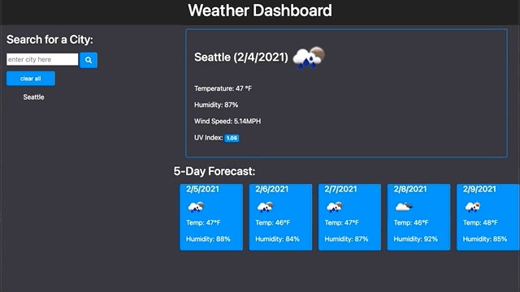

# Weather Dashboard

## Description
--- 
This is a weather dashboard, that uses a third party API called [OpenWeather API](https://openweathermap.org/api). The API was used to retrieve the inputed city's current weather and five day forecast. It pulls the data for temperature, humidity, wind speed, longitude, latitude, and the uv index from OpenWeather. As an avid traveler, I wanted to create an application that way I could track the weather of where I'm going. 

    Some of the concepts I learned: 
        * how to work with API's
        * how to store website url data to
          local storage
        
    I further understood:
        * jquery
        * local storage
        * creating elements with jquery
    

url: https://dorley1993.github.io/Weather_Dashboard/

## Table of Contents 
---
* [Languages and Libraries](#Languages)
* [Usage](#Usage)
* [License](#License)

## Languages 
---
* JavaScript
* HTML
* CSS

    Libraries used:
    * jquery
    * bootstrap
    * moment
    * fontawesome

## Usage
---
When the user opens the website you will see a search bar, with a search button next to it. Below the input area you will see a clear all. 

You enter a City within the US. 

Once you click enter, the current weather for that city will pop up and the five day forecast. 

You can clear the information by clicking clear all. Removes Local Storage Data as well.

The users Search History will be saved in the Local Storage so that next time the site is visited they will see them under the search bar. Click on the Cities to populate that city you searched for. 

## License
---
Copyright © Danielle Orley 

Permission is hereby granted, free of charge, to any person obtaining a copy of this software and associated documentation files (the "Software"), to deal in the Software without restriction, including without limitation the rights to use, copy, modify, merge, publish, distribute, sublicense, and/or sell copies of the Software, and to permit persons to whom the Software is furnished to do so, subject to the following conditions:

The above copyright notice and this permission notice shall be included in all copies or substantial portions of the Software.

THE SOFTWARE IS PROVIDED "AS IS", WITHOUT WARRANTY OF ANY KIND, EXPRESS OR IMPLIED, INCLUDING BUT NOT LIMITED TO THE WARRANTIES OF MERCHANTABILITY, FITNESS FOR A PARTICULAR PURPOSE AND NONINFRINGEMENT. IN NO EVENT SHALL THE AUTHORS OR COPYRIGHT HOLDERS BE LIABLE FOR ANY CLAIM, DAMAGES OR OTHER LIABILITY, WHETHER IN AN ACTION OF CONTRACT, TORT OR OTHERWISE, ARISING FROM, OUT OF OR IN CONNECTION WITH THE SOFTWARE OR THE USE OR OTHER DEALINGS IN THE SOFTWARE.